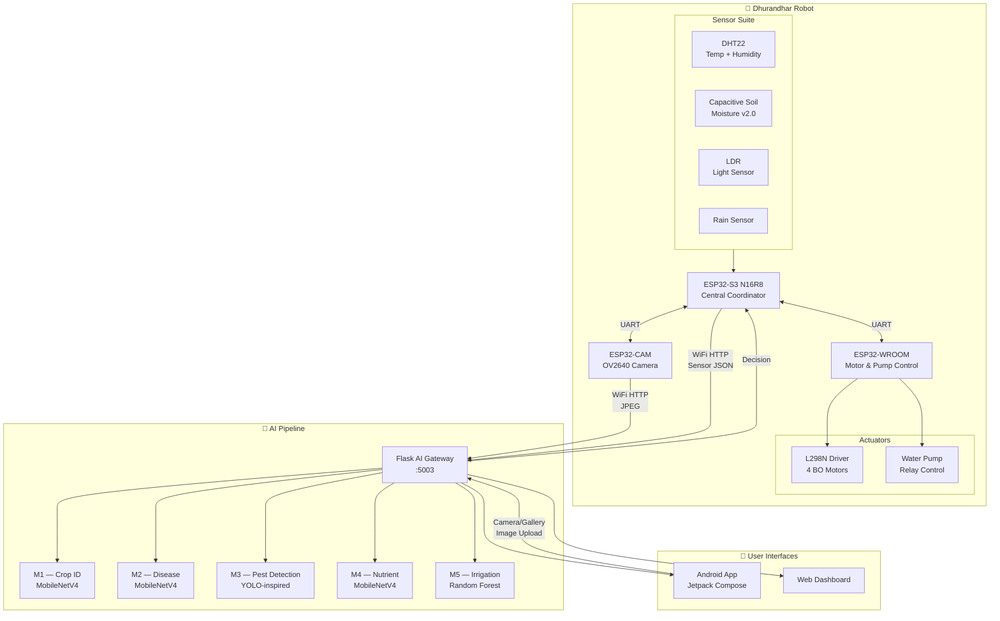

<div align="center">

# 🤖 Dhurandhar

**Edge-AI Agricultural Robotics System**

*An autonomous field robot powered by five agricultural intelligence models, onboard ESP32-based sensing and control, and a continuous sense–analyze–decide–act loop.*

[](LICENSE)
[](https://www.python.org/downloads/)
[](https://flask.palletsprojects.com/)
[](https://www.espressif.com/)

</div>

---

## Overview

Dhurandhar is a hardware + software agricultural robotics solution that autonomously navigates fields, captures crop images, reads environmental sensors, and uses five edge-oriented ML models to identify crops, detect diseases and pests, assess nutrient deficiency, and make irrigation decisions — forming a **closed-loop** intelligent farming system.

```
Move → Sense → Capture → Analyze → Understand → Decide → Act → Measure again → Repeat
```

## System Architecture



## Hardware Bill of Materials

| Component | Quantity | Role |
|-----------|----------|------|
| ESP32-S3 N16R8 | 1 | Central coordinator, sensor hub, WiFi gateway |
| ESP32-WROOM-32 | 1 | Motor driver, pump controller |
| ESP32-CAM (AI-Thinker) | 1 | Autonomous vision, JPEG capture |
| L298N Motor Driver | 1 | Dual H-bridge for 4 BO motors |
| BO Gear Motor | 4 | Chassis locomotion (4-wheel drive) |
| DHT22 Sensor | 1 | Temperature + humidity |
| Capacitive Soil Moisture v2.0 | 1 | Soil moisture (corrosion-resistant) |
| LDR Sensor Module | 1 | Light intensity |
| Rain Sensor Module | 1 | Rainfall detection |
| Relay Module (5V) | 1 | Water pump switching |
| Water Pump (12V) | 1 | Irrigation actuation |

## ML Models

| Model | Task | Architecture | Input | Output |
|-------|------|-------------|-------|--------|
| **M1** | Crop/Plant Identification | MobileNetV4-ConvSmall (shared backbone) | 256×256 RGB | 15 crop classes |
| **M2** | Disease Detection | MobileNetV4-ConvSmall (shared backbone) | 256×256 RGB | 38 disease classes |
| **M3** | Pest Detection | MobileNetV4 + PAN-FPN + DFL-free head | 640×640 RGB | Bounding boxes + 24 pest classes |
| **M4** | Nutrient Deficiency | MobileNetV4-ConvSmall | 224×224 RGB | 4 classes (Healthy, N/P/K deficiency) |
| **M5** | Irrigation Decision | Random Forest (scikit-learn) | 7 sensor features | IRRIGATE / WAIT |

## Quick Start

### 1. Clone & Setup

```bash
git clone https://github.com/YOUR_USERNAME/Dhurandhar.git
cd Dhurandhar
chmod +x scripts/setup.sh
./scripts/setup.sh
```

### 2. Start the Flask AI Gateway

```bash
./scripts/run-server.sh
# Server starts at http://localhost:5003
```

### 3. Flash ESP32 Firmware

Open the Arduino IDE and flash each board:

```
hardware/esp32-cam/firmware/esp32_cam_capture.ino      → ESP32-CAM
hardware/esp32-s3/firmware/dhurandhar_s3_main.ino       → ESP32-S3
hardware/esp32-wroom/firmware/dhurandhar_wroom_actuator.ino → ESP32-WROOM
```

Update `config.h` in each firmware directory with your WiFi credentials and Flask server IP.

### 4. API Endpoints

| Method | Endpoint | Description |
|--------|----------|-------------|
| `GET` | `/api/health` | Server health + model status |
| `GET` | `/api/models` | Loaded model details |
| `GET` | `/api/classes/<model>` | Class labels (plant / disease) |
| `POST` | `/api/predict/<model>` | Single-model inference (plant / disease / pest) |
| `POST` | `/api/analyze` | Combined M1+M2+M3 inference |
| `POST` | `/api/irrigation` | Irrigation decision from sensor data (JSON) |

## Project Structure

```
Dhurandhar/
├── README.md
├── LICENSE
├── CONTRIBUTING.md
├── .gitignore
├── .gitattributes
│
├── docs/
│   ├── architecture/
│   │   ├── system-architecture.md
│   │   ├── ml-architecture.md
│   │   ├── hardware-architecture.md
│   │   ├── software-architecture.md
│   │   └── data-flow.md
│   ├── api/
│   │   └── api-reference.md
│   ├── hardware/
│   │   ├── wiring.md
│   │   ├── pinout.md
│   │   └── communication-protocol.md
│   └── research/
│       ├── experiments.md
│       └── benchmarks.md
│
├── apps/
│   ├── android/
│   │   └── farm-assistant/
│   └── web/
│       ├── frontend/
│       └── README.md
│
├── services/
│   └── flask-api/
│       ├── app.py
│       ├── config.py
│       ├── requirements.txt
│       ├── Dockerfile
│       ├── inference/
│       ├── routes/
│       ├── schemas/
│       ├── templates/
│       └── tests/
│
├── ml/
│   ├── crop/
│   ├── disease/
│   ├── pest/
│   ├── irrigation/
│   └── nutrient/
│
├── hardware/
│   ├── esp32-cam/
│   │   ├── firmware/
│   │   ├── camera/
│   │   ├── networking/
│   │   └── README.md
│   ├── esp32-s3/
│   │   ├── firmware/
│   │   ├── sensors/
│   │   ├── control/
│   │   └── README.md
│   ├── esp32-wroom/
│   │   ├── firmware/
│   │   ├── motor-control/
│   │   ├── pump-control/
│   │   └── README.md
│   └── schematics/
│       ├── wiring/
│       ├── pinouts/
│       └── diagrams/
│
├── shared/
│   ├── api-contracts/
│   ├── json-schemas/
│   ├── uart-protocol/
│   └── constants/
│
├── datasets/
│   └── README.md
│
├── models/
│   └── README.md
│
├── scripts/
│   ├── setup.sh
│   ├── run-server.sh
│   ├── test-all.sh
│   └── export-models.sh
│
└── .github/
    ├── workflows/
    │   ├── flask.yml
    │   └── tests.yml
    ├── ISSUE_TEMPLATE/
    └── pull_request_template.md
```

## Communication Architecture

```
ESP32-CAM ──WiFi HTTP POST──→ Flask API (:5003)
                                   ↕
ESP32-S3  ──WiFi HTTP POST──→ Flask API
    ↕ UART (115200 baud, JSON)
ESP32-WROOM ──→ L298N ──→ Motors
            ──→ Relay ──→ Pump
```

**UART Protocol**: Newline-delimited JSON between ESP32-S3 and ESP32-WROOM.
See [`shared/uart-protocol/protocol.md`](shared/uart-protocol/protocol.md) for the full specification.

## Tech Stack

| Layer | Technology |
|-------|-----------|
| **ML Training** | PyTorch, TensorFlow/Keras, scikit-learn, timm, Ultralytics |
| **ML Backbone** | MobileNetV4-ConvSmall (ImageNet pretrained) |
| **API Server** | Flask, Flask-CORS, Gunicorn |
| **Android App** | Kotlin, Jetpack Compose, Material 3 |
| **Web Frontend** | Vanilla HTML/CSS/JS |
| **Firmware** | Arduino C++ (ESP32 Arduino Core) |
| **Communication** | WiFi HTTP, UART (ArduinoJson) |
| **Edge Export** | emlearn (Random Forest → C), TFLite, ONNX |

## Contributing

See [CONTRIBUTING.md](CONTRIBUTING.md) for guidelines on how to contribute to this project.

## License

This project is licensed under the MIT License — see the [LICENSE](LICENSE) file for details.
