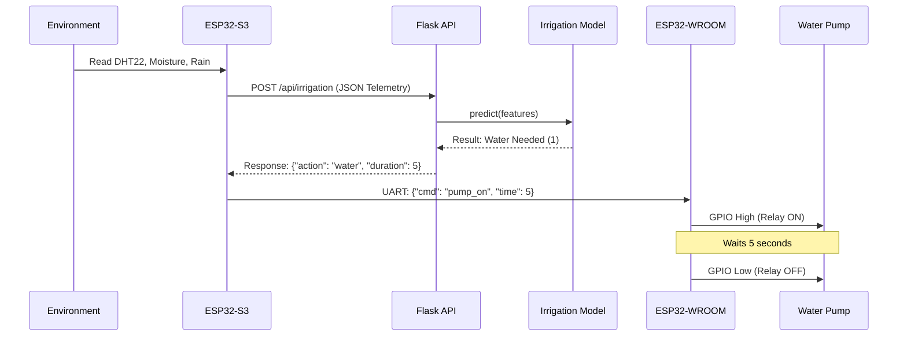
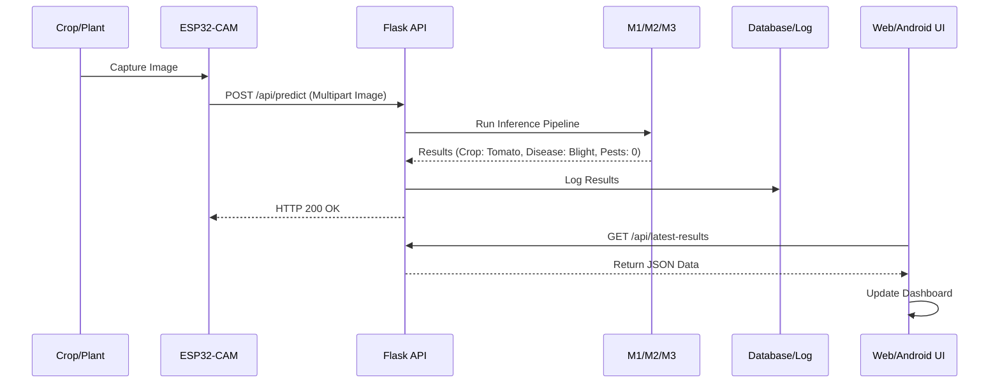

# Data Flow

This document details the end-to-end data flow for the primary operations of the Dhurandhar robot.

## Irrigation Decision Flow

```mermaid
sequenceDiagram
    participant Env as Environment
    participant S3 as ESP32-S3
    participant API as Flask API
    participant M5 as Irrigation Model
    participant WROOM as ESP32-WROOM
    participant Pump as Water Pump

    Env->>S3: Read DHT22, Moisture, Rain
    S3->>API: POST /api/irrigation (JSON Telemetry)
    API->>M5: predict(features)
    M5-->>API: Result: Water Needed (1)
    API-->>S3: Response: {"action": "water", "duration": 5}
    S3->>WROOM: UART: {"cmd": "pump_on", "time": 5}
    WROOM->>Pump: GPIO High (Relay ON)
    Note over WROOM,Pump: Waits 5 seconds
    WROOM->>Pump: GPIO Low (Relay OFF)
```

## AI Vision Flow

```mermaid
sequenceDiagram
    participant Crop as Crop/Plant
    participant CAM as ESP32-CAM
    participant API as Flask API
    participant Models as M1/M2/M3
    participant DB as Database/Log
    participant UI as Web/Android UI

    Crop->>CAM: Capture Image
    CAM->>API: POST /api/predict (Multipart Image)
    API->>Models: Run Inference Pipeline
    Models-->>API: Results (Crop: Tomato, Disease: Blight, Pests: 0)
    API->>DB: Log Results
    API-->>CAM: HTTP 200 OK
    UI->>API: GET /api/latest-results
    API-->>UI: Return JSON Data
    UI->>UI: Update Dashboard
```
