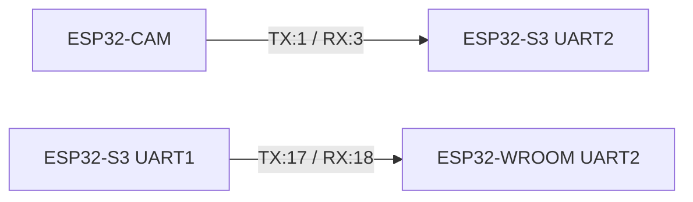

# Hardware Architecture

The Dhurandhar robot's hardware is designed around a robust 3-ESP32 topology to handle concurrent sensing, actuation, and vision tasks.

## 3-ESP32 Topology

### 1. ESP32-S3 N16R8 (Central Coordinator)
*   **Specs:** 16MB Flash, 8MB PSRAM.
*   **Role:** The brain of the robot. Gathers sensor data, communicates with the API server via WiFi, makes edge decisions (e.g., using the embedded M5 model), and sends actuation commands to the WROOM.
*   **Sensors:** Connected to all environmental sensors.

### 2. ESP32-WROOM (Actuation Node)
*   **Role:** Dedicated hardware controller. Receives commands from the S3 via UART and directly controls the motor drivers and relays. Ensures real-time responsiveness for movement.
*   **Actuators:** Drives the L298N and water pump relay.

### 3. ESP32-CAM (Autonomous Vision)
*   **Role:** Dedicated image capture. Streams or captures still images for the AI models on the Flask server.
*   **Interface:** Communicates status to S3 via UART; sends images directly to API via WiFi.

## Sensor Suite

Connected to the ESP32-S3:
*   **DHT22:** Temperature and humidity monitoring.
*   **Capacitive Soil Moisture v2.0:** Analog soil moisture reading (corrosion-resistant).
*   **LDR:** Light Dependent Resistor for ambient light levels.
*   **Rain Sensor:** Detects precipitation.

## Actuators

Connected to the ESP32-WROOM:
*   **L298N Motor Driver:** Controls 4x BO motors for differential drive locomotion.
*   **Relay (5V/3.3V):** Controls the high-current water pump.

## Power Distribution

*   A high-capacity Li-Po or SLA battery (12V) powers the system.
*   12V is routed directly to the L298N motor driver.
*   LM2596 buck converters step down 12V to 5V to power the ESP32 boards and the water pump (if 5V).
*   Sensors are powered via the 3.3V pins of the ESP32-S3.

## UART Bus Architecture

*Note: Pin numbers are logical representations and may vary based on specific board definitions.*
