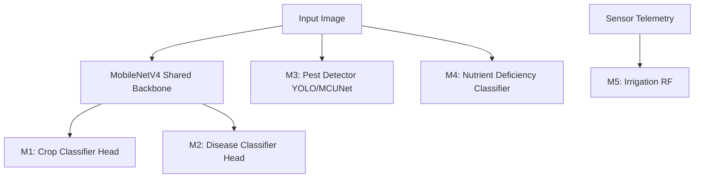

# Machine Learning Architecture

The Dhurandhar project employs a suite of machine learning models for holistic plant care and navigation.

## Model Dependency Diagram

Models M1 (Crop) and M2 (Disease) share a MobileNetV4 backbone to optimize feature extraction.

## Input/Output Contracts

| Model | Task | Input | Output |
|---|---|---|---|
| M1 | Crop Classification | 224x224 RGB Image | Crop Class ID (15 classes) |
| M2 | Disease Classification | 224x224 RGB Image | Disease Class ID (38 classes) |
| M3 | Pest Detection | 640x640 RGB Image | Bounding Boxes + Pest Class (24 classes) |
| M4 | Nutrient Analysis | 224x224 RGB Image | Nutrient State (Healthy, N, P, K def) |
| M5 | Irrigation Decision | 7 numeric features | Binary (1=Water, 0=Do Not Water) |

## Training Infrastructure

*   **M1 - M4 (Vision Models):** Developed and trained using PyTorch. Custom training loops are used for the shared backbone of M1/M2.
*   **M5 (Tabular Model):** Trained using scikit-learn (RandomForestClassifier).

## Model Export Paths

To support varied deployment environments (Server vs. Edge), models are exported to standard formats:

*   **Keras/TensorFlow Models (Legacy/Alternative):** `SavedModel` → `TFLite`
*   **PyTorch Models (M1-M4):** `.pt` → `ONNX`
*   **Scikit-learn Model (M5):** `.joblib` → `emlearn` (C header)

## Edge Deployment Considerations

While most vision inference currently runs on the Flask API gateway, M5 (Irrigation) is exported as embedded C code via `emlearn`. This allows the ESP32-S3 to make autonomous irrigation decisions even when disconnected from the WiFi network, ensuring crop safety. Future work involves quantizing M3 via Student MCUNet for direct ESP32-CAM execution.
