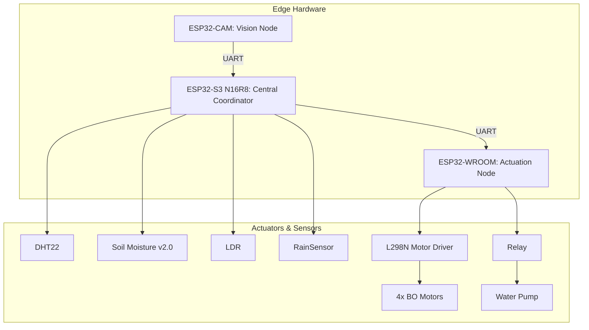
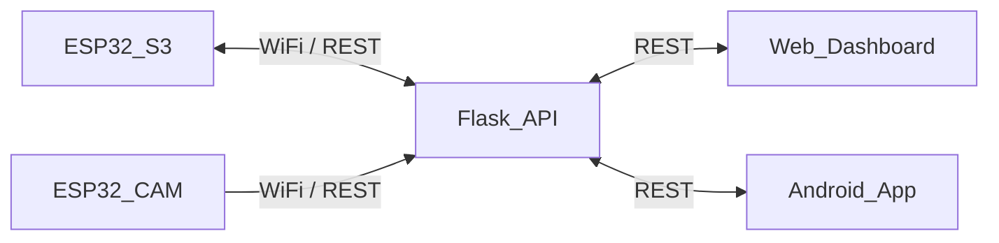
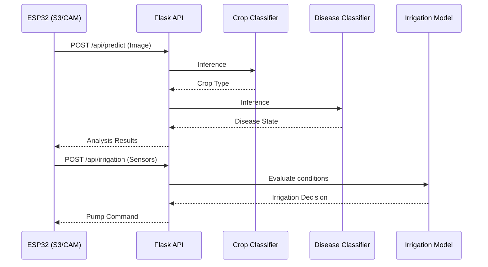

# System Architecture

The Dhurandhar agricultural robotics project utilizes a distributed computing architecture spanning edge devices, local servers, and cloud interfaces. This document outlines the holistic system design.

## 3-ESP32 Hardware Topology

The robot's edge intelligence and control are distributed across three ESP32 microcontrollers to ensure modularity and reliability.

## Software Stack Layers

The software architecture is divided into distinct layers:

1.  **Hardware Abstraction Layer (HAL):** Firmware running on the ESP32s (C++).
2.  **Communication Layer:** UART for intra-robot communication; WiFi (HTTP/REST) for robot-to-server.
3.  **Inference Service Layer:** Flask API gateway handling requests and orchestrating ML model inference.
4.  **Application Layer:** Android app (Jetpack Compose) and Web dashboard for user interaction.

## Communication Paths

## AI Pipeline Flow

The AI pipeline is triggered by incoming telemetry or images.

## Design Decisions and Trade-offs

*   **Multi-MCU Design:** Using 3 ESP32s prevents blocking operations. The camera node doesn't halt motor control during image capture. Trade-off: increased complexity in UART communication and power distribution.
*   **Centralized AI vs Edge AI:** Heavy vision models run on the Flask server due to ESP32 memory constraints. Trade-off: Requires reliable WiFi connection, but allows for much more accurate, larger models (MobileNet, YOLO) than TinyML on edge.
