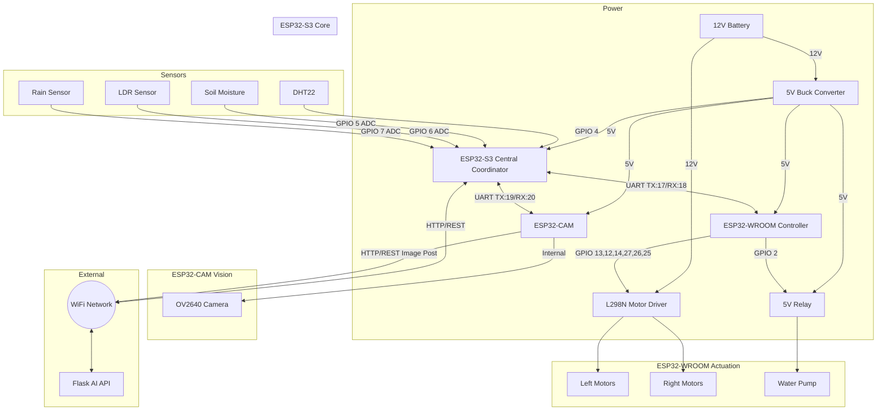

# System Block Diagram

```mermaid
graph TD
    %% Power Subsystem
    subgraph Power
        BATT[12V Battery]
        BUCK[5V Buck Converter]
        BATT -->|12V| L298N
        BATT -->|12V| BUCK
        BUCK -->|5V| S3
        BUCK -->|5V| WROOM
        BUCK -->|5V| CAM
        BUCK -->|5V| RELAY
    end

    %% Central Logic
    subgraph ESP32-S3 Core
        S3[ESP32-S3 Central Coordinator]
    end

    %% Sensor Subsystem
    subgraph Sensors
        DHT[DHT22] -->|GPIO 4| S3
        SOIL[Soil Moisture] -->|GPIO 5 ADC| S3
        LDR[LDR Sensor] -->|GPIO 6 ADC| S3
        RAIN[Rain Sensor] -->|GPIO 7 ADC| S3
    end

    %% Actuation Subsystem
    subgraph ESP32-WROOM Actuation
        WROOM[ESP32-WROOM Controller]
        S3 <-->|UART TX:17/RX:18| WROOM
        WROOM -->|GPIO 13,12,14,27,26,25| L298N[L298N Motor Driver]
        L298N --> M_L[Left Motors]
        L298N --> M_R[Right Motors]
        
        WROOM -->|GPIO 2| RELAY[5V Relay]
        RELAY --> PUMP[Water Pump]
    end

    %% Vision Subsystem
    subgraph ESP32-CAM Vision
        CAM[ESP32-CAM]
        S3 <-->|UART TX:19/RX:20| CAM
        CAM -->|Internal| LENS[OV2640 Camera]
    end

    %% Cloud/API
    subgraph External
        WIFI((WiFi Network))
        API[Flask AI API]
        S3 <-->|HTTP/REST| WIFI
        CAM -->|HTTP/REST Image Post| WIFI
        WIFI <--> API
    end
```
